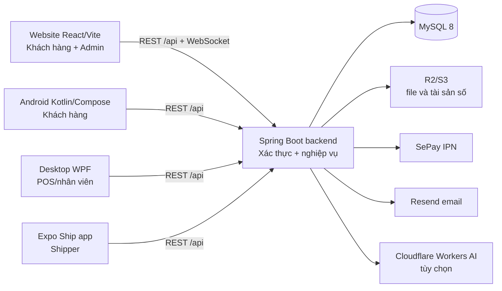
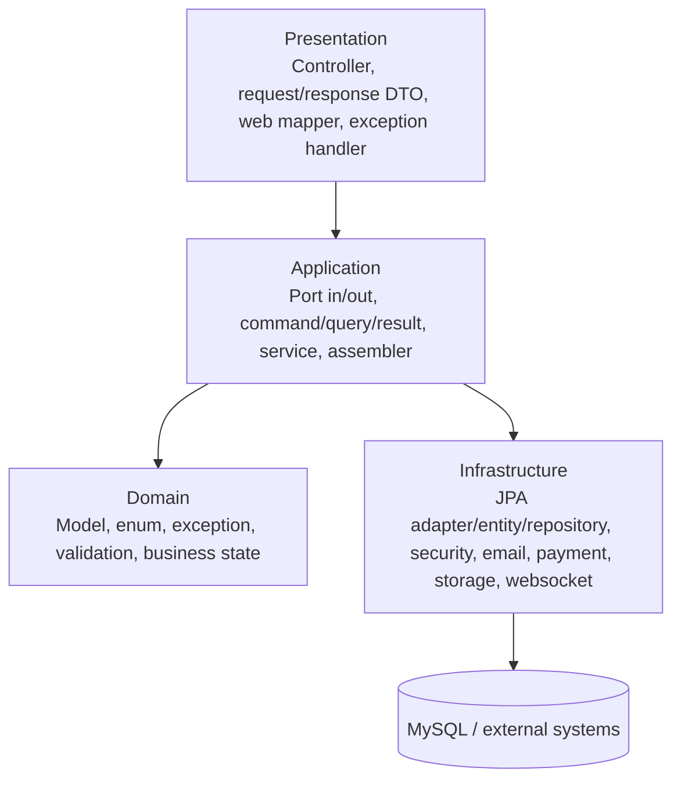

# Hướng dẫn đọc hiểu dự án Bookstore cho người mới

> Mục tiêu của tài liệu: sau khi đọc, một thành viên mới biết dự án gồm những phần nào, phần nào là lõi, cách chạy an toàn ở máy local, bắt đầu đọc code từ đâu, và lần theo một chức năng từ giao diện đến database như thế nào.
>
> Phạm vi: tài liệu mô tả mã nguồn đang có trong repository tại `D:\bookstore`, không chỉ hai module backend/website. Các báo cáo smoke hoặc tiến độ có ngày cũ là bằng chứng lịch sử; khi cần biết trạng thái chạy thực tế, hãy kiểm tra lại bằng lệnh test/build và runtime hiện tại.

## Mục lục

1. [Bức tranh tổng thể](#1-bức-tranh-tổng-thể)
2. [Các module và vai trò](#2-các-module-và-vai-trò)
3. [Khởi động local lần đầu](#3-khởi-động-local-lần-đầu)
4. [Lộ trình đọc code cho người mới](#4-lộ-trình-đọc-code-cho-người-mới)
5. [Backend: kiến trúc, luồng request và dữ liệu](#5-backend-kiến-trúc-luồng-request-và-dữ-liệu)
6. [Website: kiến trúc React và cách nối API](#6-website-kiến-trúc-react-và-cách-nối-api)
7. [Ba client còn lại](#7-ba-client-còn-lại)
8. [Các miền nghiệp vụ quan trọng](#8-các-miền-nghiệp-vụ-quan-trọng)
9. [Bảo mật, session và realtime](#9-bảo-mật-session-và-realtime)
10. [Database, migration, transaction và dữ liệu mẫu](#10-database-migration-transaction-và-dữ-liệu-mẫu)
11. [Cách thêm hoặc sửa một chức năng](#11-cách-thêm-hoặc-sửa-một-chức-năng)
12. [Kiểm thử, CI, gỡ lỗi và tài liệu liên quan](#12-kiểm-thử-ci-gỡ-lỗi-và-tài-liệu-liên-quan)
13. [Từ điển nhanh](#13-từ-điển-nhanh)

---

## 1. Bức tranh tổng thể

Bookstore là một hệ thống bán sách đa client. **Backend Spring Boot là nguồn nghiệp vụ trung tâm**: mọi client đều gọi API của backend, backend mới là nơi kiểm tra quyền, quản lý tồn kho, tạo đơn, thanh toán, hoàn tiền và ghi dữ liệu MySQL.



Luồng cơ bản của một thao tác là:

1. Người dùng thao tác trên một client, ví dụ nhấn “đặt hàng”.
2. Client gọi endpoint `/api/...` của backend, kèm access token khi endpoint cần đăng nhập.
3. Controller của backend nhận DTO request, kiểm tra dữ liệu đầu vào và quyền.
4. Application service điều phối nghiệp vụ, transaction, các port/repository và domain model.
5. Adapter JPA chuyển domain model thành entity để đọc/ghi MySQL; adapter khác gọi hệ thống ngoài khi cần.
6. Backend trả JSON theo vỏ `ApiResponse<T>`; client cập nhật state và giao diện.

**Nguyên tắc quan trọng khi đọc/sửa code:** giao diện chỉ hỗ trợ trải nghiệm; không coi điều kiện ẩn/hiện trên client là bảo mật. Kiểm tra quyền, trạng thái đơn hàng, tồn kho, coupon và ownership phải được backend xác nhận.

## 2. Các module và vai trò

| Module | Công nghệ chính | Vai trò | Điểm bắt đầu nên đọc |
| --- | --- | --- | --- |
| `bookstore-backend` | Java 21, Spring Boot 3.5, Spring Security, JPA, Flyway, MySQL 8 | API và toàn bộ nghiệp vụ lõi | `src/main/java/com/bookstore/bookstore/BookstoreApplication.java`, sau đó `presentation/`, `application/`, `domain/` |
| `bookstore-website` | React 19, TypeScript, Vite 8, Tailwind 4, React Router 7 | Storefront khách hàng và backoffice admin | `src/main.tsx`, `src/App.tsx`, `src/routes/AppRoutes.tsx`, `src/services/api.ts` |
| `bookstore-mobile` | Kotlin, Jetpack Compose, Retrofit, DataStore | Ứng dụng Android cho khách hàng | `MainActivity.kt`, `app/AppNavHost.kt`, `core/network/ApiService.kt` |
| `bookstore-desktop/Bookstore.Desktop` | C#/.NET 10, WPF, CommunityToolkit.Mvvm | POS và công cụ vận hành tại quầy | `App.xaml`, `MainWindow.xaml`, `Services/ApiClient.cs`, `ViewModels/PosViewModel.cs` |
| `bookstore-shipapp` | Expo 56, React Native, TypeScript, Expo Router | Ứng dụng riêng cho shipper nhận/cập nhật shipment | `app/`, `src/context/session-context.tsx`, `src/services/shipments.ts` |
| `docs` | Markdown | Hợp đồng API, vận hành, smoke và hướng dẫn | Tài liệu này, rồi các tài liệu chuyên đề ở phần cuối |
| `.github/workflows/ci.yml` | GitHub Actions | CI theo từng thư mục module thay đổi | Đọc sau khi hiểu các module |

### Cây thư mục cần nhớ

```text
D:\bookstore
├── bookstore-backend/       # API + nghiệp vụ + MySQL
├── bookstore-website/       # Website khách hàng và admin
├── bookstore-mobile/        # Android khách hàng
├── bookstore-desktop/       # WPF POS/nhân viên
├── bookstore-shipapp/       # Expo app cho shipper
├── docs/                    # Tài liệu vận hành và hợp đồng
├── scripts/                 # smoke demo cấp repository
├── .github/workflows/ci.yml # pipeline CI
└── README.md                # lệnh chạy nhanh ở root
```

Nếu mới vào dự án, hãy xem **backend + website trước**. Mobile, desktop và shipapp là các client sử dụng cùng API, nên đọc chúng sau khi đã hiểu API và quy tắc nghiệp vụ ở backend.

## 3. Khởi động local lần đầu

### 3.1 Điều kiện cần

- Docker Desktop để chạy MySQL 8.
- JDK 21 cho backend và Gradle Android.
- Node.js từ 22.13 trở lên và Corepack cho website (`pnpm@11.11.0`).
- Android Studio/Android SDK nếu làm mobile.
- .NET 10 SDK trên Windows nếu làm desktop.
- Node.js + npm cho Expo ship app.

Không commit `.env`, mật khẩu, API token, khóa JWT hoặc thông tin ngân hàng thật. Các file `.env.example` chỉ là khuôn mẫu.

### 3.2 Chạy lõi hệ thống: MySQL + backend + website

Mở **hai hoặc ba terminal riêng**. Thứ tự dễ kiểm tra nhất là database, backend, rồi website.

#### Terminal 1 — MySQL

```powershell
cd D:\bookstore\bookstore-backend
Copy-Item .env.example .env
# Điền các giá trị local phù hợp trong .env, đặc biệt DB_PASSWORD và JWT_SECRET.
docker compose up -d
docker ps
```

`docker-compose.yml` tạo container MySQL 8, database và user dựa vào `DB_*` trong `.env`. Dữ liệu được giữ trong Docker volume `bookstore_mysql_data`.

#### Terminal 2 — Backend

```powershell
cd D:\bookstore\bookstore-backend
.\mvnw.cmd --% spring-boot:run -Dspring-boot.run.profiles=dev
```

Điểm kiểm tra đầu tiên:

```text
http://localhost:8080/actuator/health
```

Swagger chỉ có khi `APP_SWAGGER_ENABLED=true`:

```text
http://localhost:8080/swagger-ui/index.html
```

#### Terminal 3 — Website

```powershell
cd D:\bookstore\bookstore-website
Copy-Item .env.example .env
corepack enable
pnpm install --frozen-lockfile
pnpm dev
```

Mở:

```text
http://localhost:5173
```

`VITE_API_BASE_URL` trong `bookstore-website/.env` thường là `http://localhost:8080/api`. Backend phải cho phép origin `http://localhost:5173` trong `CORS_ALLOWED_ORIGINS`.

### 3.3 Profile và dữ liệu mẫu của backend

| Profile | Mục đích | Lưu ý |
| --- | --- | --- |
| `dev` | Phát triển local | JPA dùng `ddl-auto: update`; phù hợp làm việc local, không là chuẩn tạo schema production |
| `prod` | Runtime production/prod-like | Flyway bật, JPA dùng `ddl-auto: validate`; schema được tạo/nâng cấp qua migration |
| `seed` | Tạo demo data trên schema mới | Chạy xong tự thoát; chỉ dùng database trống/local và phải đặt password demo qua biến môi trường |

Để tạo dữ liệu demo có chủ đích, đọc kỹ `bookstore-backend/src/main/resources/application-seed.yml` và `bookstore-backend/scripts/reset-and-seed.ps1` trước. Không chạy script reset/seed lên database dùng chung hoặc production.

### 3.4 Chạy các client còn lại

**Android:** mở `D:\bookstore\bookstore-mobile` bằng Android Studio, hoặc:

```powershell
cd D:\bookstore\bookstore-mobile
.\gradlew.bat testDebugUnitTest
.\gradlew.bat assembleDebug
```

Android emulator gọi backend local bằng `http://10.0.2.2:8080`, còn điện thoại thật phải dùng IP LAN/HTTPS phù hợp — không dùng `localhost`.

**Desktop WPF:**

```powershell
cd D:\bookstore\bookstore-desktop\Bookstore.Desktop
dotnet restore
dotnet build
dotnet run
```

**Ship app:**

```powershell
cd D:\bookstore\bookstore-shipapp
Copy-Item .env.example .env
npm ci
npm start
```

Ship app lấy base URL từ `EXPO_PUBLIC_API_BASE_URL`; trên điện thoại thật cũng phải dùng IP LAN hoặc một URL HTTPS có thể truy cập được.

## 4. Lộ trình đọc code cho người mới

Đừng cố đọc theo thứ tự file. Cách hiệu quả nhất là đi từ **đường đi của dữ liệu** và chọn một luồng nhỏ trước.

### Buổi đầu tiên: dựng bản đồ trong 45 phút

1. Đọc phần [Bức tranh tổng thể](#1-bức-tranh-tổng-thể) và bảng module ở trên.
2. Mở `README.md` để biết lệnh local ngắn gọn, rồi đọc `.env.example` của backend và website để hiểu ranh giới cấu hình.
3. Mở backend `BookstoreApplication.java`, `application.yml`, `application-dev.yml`, `application-prod.yml`.
4. Mở website `src/main.tsx` → `src/App.tsx` → `src/routes/AppRoutes.tsx` → `src/services/api.ts`.
5. Chạy website và mở Swagger để nhìn endpoint thật. Chưa cần hiểu hết controller.

### Bài đọc đầu tiên nên chọn: danh sách sách

Luồng này gần như không có quyền/transaction phức tạp, rất phù hợp để học kiến trúc.

```text
Website
src/pages/book/books.tsx
  → src/hooks/use-book-listing.ts hoặc use-book-catalog.ts
  → src/services/book-service.ts
  → GET /api/books hoặc /api/books/search

Backend
presentation/controller/BookController.java
  → application/port/in/IBookQueryService.java
  → application/service/BookQueryService.java
  → application/port/out/IBookRepository.java
  → infrastructure/persistence/adapter/BookRepositoryAdapter.java
  → infrastructure/persistence/repository/BookJpaRepository.java
  → MySQL

Trả về
BookWebMapper → BookResponse → ApiResponse<List<BookResponse>>
```

Sau luồng này, bạn sẽ hiểu bốn lớp backend, `ApiResponse`, mapper, port, service và repository adapter là gì.

### Bài đọc thứ hai: đăng nhập web

Đây là luồng tốt để hiểu bảo mật và khác biệt web/native:

```text
Login page
  → AuthContext
  → auth-service.ts / api.ts
  → POST /api/auth/web/login + CSRF header
  → WebAuthController
  → AuthService
  → refresh-token repository + JwtService
  → browser nhận HttpOnly refresh cookie, access token chỉ giữ trong memory
```

Các file cần mở theo thứ tự:

1. `bookstore-website/src/contexts/auth-context.tsx`
2. `bookstore-website/src/services/auth-service.ts`
3. `bookstore-website/src/services/api.ts`
4. `bookstore-backend/src/main/java/com/bookstore/bookstore/presentation/controller/WebAuthController.java`
5. `bookstore-backend/src/main/java/com/bookstore/bookstore/application/service/AuthService.java`
6. `bookstore-backend/src/main/java/com/bookstore/bookstore/infrastructure/security/SecurityConfig.java`
7. `docs/AUTH_API_CONTRACT.md` và `docs/AUTH_SESSION_SECURITY.md`

### Bài đọc thứ ba: checkout

Checkout là luồng nhiều quy tắc nhất và nên đọc sau hai luồng trên.

```text
Checkout page
  → use-checkout-flow.ts
  → order-service.ts (gửi Idempotency-Key)
  → POST /api/orders/checkout
  → OrderController
  → OrderService.checkout
  → khóa cart, inventory và coupon; tạo Order + Payment
  → timeline/audit/outbox notification
```

File chính:

- Website: `src/pages/cart/checkout.tsx`, `src/hooks/use-checkout-flow.ts`, `src/services/order-service.ts`.
- Backend: `presentation/controller/OrderController.java`, `application/service/OrderService.java`, `application/service/OrderCancellationService.java`, `application/service/PaymentService.java`.
- Hợp đồng trạng thái: `docs/ORDER_PAYMENT_API_CONTRACT.md`, `docs/ORDER_PAYMENT_STATE_TRANSITIONS.md`, `docs/REFUND_STATE_TRANSITIONS.md`, `docs/TRANSACTIONAL_OUTBOX.md`.

### Khi cần tìm code nhanh

Chạy từ `D:\bookstore`:

```powershell
# Tìm endpoint backend hoặc tên business rule
rg -n "orders/checkout|Idempotency-Key|ORDER_PAID_REFUND_REQUIRED" bookstore-backend/src

# Tìm route UI
rg -n 'path="/admin|path="/checkout' bookstore-website/src/routes/AppRoutes.tsx

# Tìm nơi một service web gọi API
rg -n "createOrder|/orders/checkout" bookstore-website/src

# Tìm test của một lớp backend
rg --files bookstore-backend/src/test | rg "OrderService|OrderController"
```

Khi bắt đầu một chức năng mới, hãy tìm **endpoint hoặc mã lỗi** trước, rồi lần ngược lên page/hook ở client và lần xuôi xuống service/repository ở backend. Cách này tin cậy hơn việc đoán từ tên thư mục.

## 5. Backend: kiến trúc, luồng request và dữ liệu

### 5.1 Stack và entrypoint

- Java 21, Spring Boot 3.5.14, Maven Wrapper.
- Spring Web, Validation, Security, OAuth2 Resource Server, WebSocket và Actuator.
- Spring Data JPA + MySQL 8.
- Flyway cho schema production.
- Test: JUnit 5, Mockito, Spring Security Test, H2 và Testcontainers MySQL.
- Tích hợp tùy chọn: Resend, SePay, S3-compatible/R2, Cloudflare Workers AI.

Entrypoint là `bookstore-backend/src/main/java/com/bookstore/bookstore/BookstoreApplication.java`.

### 5.2 Bốn lớp chính



| Lớp | Nằm ở | Trách nhiệm | Không nên làm |
| --- | --- | --- | --- |
| Presentation | `presentation/` | HTTP, DTO, validation request, map response, annotation quyền | Chứa transaction dài, SQL, hoặc quy tắc nghiệp vụ lõi |
| Application | `application/` | Use case, transaction, phối hợp nhiều aggregate/port, command/query/result | Phụ thuộc trực tiếp vào controller hoặc JPA entity |
| Domain | `domain/` | Trạng thái, invariant và hành vi nghiệp vụ của model | Import Spring, JPA hoặc HTTP |
| Infrastructure | `infrastructure/` | Chi tiết kỹ thuật: JPA, JWT, external provider, email, storage, WebSocket | Quyết định chính sách nghiệp vụ cấp use case |

Đây là **tactical DDD/Clean/Hexagonal**, không cần hiểu như một mô hình “DDD hoàn hảo”. Điều quan trọng là hướng phụ thuộc: controller không gọi repository JPA trực tiếp; service phụ thuộc interface port; adapter thực thi port đó.

### 5.3 Cấu trúc package

```text
src/main/java/com/bookstore/bookstore/
├── domain/
│   ├── model/          # Book, Order, Payment, User, Cart, Refund...
│   ├── enums/          # OrderStatus, PaymentStatus, UserStatus...
│   ├── exception/      # DomainException + DomainErrorCode
│   └── validation/
├── application/
│   ├── port/in/        # interface use case: IOrderService, IBookService...
│   ├── port/out/       # interface ra ngoài: IOrderRepository, IEmailSender...
│   ├── command/        # input nội bộ của use case
│   ├── query/          # PageQuery và điều kiện đọc
│   ├── result/         # output nội bộ của use case
│   ├── service/        # điều phối nghiệp vụ/transaction
│   └── assembler/      # map domain ↔ command/result
├── infrastructure/
│   ├── persistence/    # entity, JPA repository, adapter, mapper, projection
│   ├── security/       # JWT, password, CORS, CSRF web, Google
│   ├── payment/        # SePay
│   ├── storage/        # R2/S3 asset
│   ├── email/          # Resend
│   ├── websocket/      # realtime
│   ├── outbox/         # worker transactional outbox
│   └── ai/             # Cloudflare Workers AI
├── presentation/
│   ├── controller/     # REST controllers
│   ├── request/        # HTTP request DTO
│   ├── response/       # HTTP response DTO và ApiResponse
│   ├── mapper/         # request/response mapper
│   ├── exception/      # exception handlers
│   └── support/        # helper web/audit
├── config/
└── shared/
```

### 5.4 Quy ước dữ liệu và lỗi

- Khóa chính là `UUID`, không dùng auto-increment.
- Nhiều aggregate dùng **soft delete** qua `deletedAt`. Vì vậy repository có các hàm dạng `find...Active`, `find...IncludingDeleted`; chọn đúng hàm là một phần của nghiệp vụ.
- Controller trả envelope `ApiResponse<T>` gồm `success`, `message`, `data`, `code`, `timestamp`.
- Client phải dựa vào `code` để rẽ nhánh lỗi nghiệp vụ, không so chuỗi thông báo tiếng Việt.
- Vi phạm rule domain dùng `DomainException(DomainErrorCode...)`; lỗi use case dùng `ApplicationException(ApplicationErrorCode...)`. `GlobalExceptionHandler` đổi chúng thành HTTP status và envelope lỗi.
- `@PreAuthorize` và `SecurityConfig` cùng tạo lớp bảo vệ. Route web bị chặn chỉ ở frontend vẫn chưa đủ.

### 5.5 Dòng chảy request chuẩn

Lấy `GET /api/books?page=0&size=12` làm ví dụ:

1. `BookController.getAll` đọc query params, tạo `PageQuery`.
2. Controller gọi interface `IBookQueryService`, không gọi JPA repository.
3. `BookQueryService.getAll(PageQuery)` lấy sách active qua `IBookRepository` và enrich dữ liệu hiển thị cần thiết.
4. `BookRepositoryAdapter` thực thi port bằng `BookJpaRepository` và map JPA entity ↔ domain `Book`.
5. Service trả `BookQueryResult`; `BookWebMapper` đổi sang `BookResponse`.
6. Controller đặt pagination headers, bọc danh sách trong `ApiResponse.success(...)`.

Khi debug sai dữ liệu, hãy dừng ở từng ranh giới trên để biết sai ở query, mapper, rule service hay UI, thay vì sửa bừa ở component cuối cùng.

### 5.6 Controller theo miền nghiệp vụ

Không cần thuộc hết endpoint. Dùng bảng này để biết nên bắt đầu ở đâu.

| Nhóm | Controller/backend service tiêu biểu | Website/page tiêu biểu |
| --- | --- | --- |
| Xác thực, OTP, session | `AuthController`, `WebAuthController`, `OtpController`, `AuthService` | `pages/auth/*`, `AuthContext` |
| Catalog sách | `BookController`, `AuthorController`, `CategoryController`, `PublisherController`, `BookQueryService` | `pages/book/books.tsx`, `book-detail.tsx` |
| Cart, coupon, checkout | `CartController`, `CouponController`, `OrderController`, `OrderService`, `PaymentService` | `pages/cart/*`, `use-checkout-flow.ts` |
| Đơn, giao hàng, hoàn/trả | `ShipmentController`, `ReturnRequestController`, `RefundController`, `OrderCancellationService` | `pages/order/*`, `pages/admin/shipments.tsx`, `refunds.tsx` |
| Tài sản số/thư viện | `FileController`, `DigitalLibraryController`, `DigitalAssetService` | `pages/library/*`, `pages/book/ebooks.tsx` |
| Cộng đồng cá nhân | `WishlistController`, `BookshelfController`, `ReadingJournalController`, `ReadingStreakController`, `ReviewController` | wishlist, shelves, reading journal, reviews |
| Backoffice | dashboard/report/audit/inventory/import/user/role/permission controllers | `pages/admin/*` và `hooks/use-admin-*.ts` |
| Realtime và hỗ trợ | `ChatController`, `NotificationController`, `AiChatService` | `ChatProvider`, `NotificationProvider`, các `*-realtime-service.ts` |
| Hệ thống vận hành | `OutboxController`, `PaymentReconciliationController`, `NewsletterController` | admin outbox, payment reconciliation, support pages |

## 6. Website: kiến trúc React và cách nối API

### 6.1 Entry và provider tree

Thứ tự boot:

```text
src/main.tsx
  → src/App.tsx
  → LanguageProvider
  → ThemeProvider
  → DeployStartupGate
  → AuthProvider
  → NotificationProvider
  → ChatProvider
  → CartProvider
  → WishlistProvider
  → AppRoutes
```

`App.tsx` là bản đồ state toàn cục. Nếu một component cần dữ liệu đăng nhập, giỏ hàng, ngôn ngữ, giao diện sáng/tối, chat hay notification, hãy tìm Context tương ứng trước khi tạo state trùng lặp.

### 6.2 Routing và quyền giao diện

`src/routes/AppRoutes.tsx` khai báo toàn bộ route và dùng `React.lazy()` để chia bundle theo page. `src/routes/protected-route.tsx` chỉ cho vào các route yêu cầu đăng nhập/role như admin hoặc staff.

Các nhóm route chính:

- Public: `/`, `/books`, `/books/:id`, `/ebooks`, trang hỗ trợ, login/register.
- Customer login-required: `/cart`, `/checkout`, `/orders`, `/wishlist`, `/shelves`, `/reading-journal`, `/library`, `/profile`, `/notifications`.
- Admin/staff: `/admin/*`; phần lớn yêu cầu `ADMIN`, còn audit/chat có thể cho `STAFF` theo route.

`ProtectedRoute` chỉ cải thiện UX. Backend vẫn là nguồn phán quyết role thực tế.

### 6.3 Cách một page gọi API

Đường đi thường là:

```text
Page (src/pages/...)
  → custom hook (src/hooks/use-...)
  → service (src/services/...)
  → Axios instance (src/services/api.ts)
  → backend /api/...
  → types (src/types/...)
```

- **Page** tập trung layout và gắn event.
- **Hook** giữ state, effect, loading/error và điều phối dữ liệu của màn hình.
- **Service** là nơi URL/method/API payload được viết.
- **Types** giữ contract TypeScript; cập nhật type cùng lúc khi backend response đổi.
- **Utils** chứa logic thuần, có thể unit test độc lập; nhiều file có `*.test.ts` ngay bên cạnh.

Ví dụ checkout: `pages/cart/checkout.tsx` render form → `use-checkout-flow.ts` tạo request, quản lý retry/idempotency và điều hướng → `services/order-service.ts` gửi `POST /orders/checkout` với header `Idempotency-Key`.

### 6.4 Axios, refresh token và CSRF của website

`src/services/api.ts` là file cần đọc trước khi sửa bất kỳ service nào:

- `baseURL` lấy từ `VITE_API_BASE_URL`; local hostname được chuẩn hóa để tránh trộn cookie giữa `localhost` và `127.0.0.1`.
- Axios bật `withCredentials: true` để browser gửi refresh cookie web.
- Access token chỉ giữ trong biến memory qua `setAccessToken`, được thêm vào header `Authorization` khi có.
- Khi request nhận `401`, interceptor gọi **một** refresh promise dùng chung (`/auth/web/refresh`) rồi retry request ban đầu.
- Login, Google login, refresh và logout web đi qua `postWebAuth`, lấy/gửi CSRF token theo double-submit cookie.
- Không đưa refresh/access token vào `localStorage`. `auth_user` chỉ là snapshot profile để UI, không phải credential.

### 6.5 State, giao diện và i18n

| Khu vực | File chính | Ý nghĩa |
| --- | --- | --- |
| Đăng nhập | `contexts/auth-context.tsx` | hydrate session, login/logout, profile hiện tại |
| Giỏ hàng | `contexts/cart-context.tsx` | số lượng, refresh cart, thao tác chung |
| Wishlist | `contexts/wishlist-context.tsx` | trạng thái yêu thích |
| Realtime | `contexts/chat-context.tsx`, `notification-context.tsx` | kết nối/sự kiện chat và notification |
| Ngôn ngữ | `contexts/language-context.tsx`, `locales/messages.ts` | hàm `t(...)` và chuỗi hiển thị |
| Theme | `contexts/theme-context.tsx`, `public/theme-init.js` | tránh flash theme và lưu lựa chọn giao diện |
| UI dùng lại | `components/common/`, `components/layout/` | button/input/dialog, header/footer/sidebar/toast |

Khi thêm text mới, đừng hard-code một ngôn ngữ trong page nếu khu vực đó đã dùng `useLanguage()`; thêm key phù hợp trong `src/locales/messages.ts`.

### 6.6 Các feature folder đáng chú ý

- `pages/book/` và `components/book/`: catalog, detail, ebook, wishlist, shelf, journal, gift finder.
- `pages/cart/`, `pages/order/`, `components/order/`: giỏ, checkout, xác nhận, timeline, return request.
- `pages/library/`: digital library, trang chi tiết và reader.
- `pages/admin/` + `hooks/use-admin-*.ts`: các màn hình vận hành; page mỏng, hook giữ logic fetch/filter/action.
- `components/chat/` và `components/admin/chat/`: hai mặt của chat khách/admin.
- `services/*-realtime-service.ts`: cầu nối WebSocket/STOMP cho sự kiện realtime.

## 7. Ba client còn lại

### 7.1 Android — `bookstore-mobile`

Đây là client native cho khách hàng, không phải bản copy giao diện website.

```text
MainActivity
  → app/BookstoreMobileApp.kt
  → app/AppNavHost.kt + AppRoute.kt
  → feature/<feature>/ui
  → feature/<feature>/viewmodel
  → feature/<feature>/data/*Repository.kt
  → core/network/ApiService.kt (Retrofit/OkHttp)
```

- Các feature hiện có: auth/OTP, book, cart, checkout, order, profile/settings, home.
- Mỗi feature thường có `data`, `dto`, `ui`, `viewmodel`.
- `core/network/AuthInterceptor.kt` thêm bearer token; `TokenAuthenticator.kt` xử lý refresh.
- `core/storage/TokenDataStore.kt` và cấu hình bảo mật liên quan là nơi cần đọc trước khi thay đổi session native.
- Compose UI nằm trong `feature/*/ui`; state màn hình nên ở ViewModel, không để network call trực tiếp trong composable.

### 7.2 Desktop WPF — `bookstore-desktop/Bookstore.Desktop`

Desktop phục vụ nghiệp vụ tại quầy/POS, tồn kho, tra đơn, báo cáo và in receipt.

```text
XAML View
  → ViewModel (CommunityToolkit.Mvvm)
  → Service
  → ApiClient
  → backend REST API
```

Các điểm cần đọc:

- `Config/AppConfig.cs`, `Config/DotEnvConfiguration.cs`: URL/cấu hình app.
- `Services/ApiClient.cs`: HTTP chung và xử lý token.
- `Stores/AuthStore.cs`, `Stores/PosCartStore.cs`: state lâu sống trong app.
- `ViewModels/PosViewModel.cs`, `Services/PosService.cs`: luồng bán hàng POS.
- `Services/ReceiptFactory.cs`, `ReceiptPrinterService.cs`: tạo/xuất hóa đơn.
- `Views/*.xaml` là UI; `.xaml.cs` chỉ nên chứa code-behind liên quan giao diện.

Project target `net10.0-windows`. Lưu ý kỹ thuật hiện tại: workflow CI đang cài .NET `8.0.x` trong khi file `.csproj` target .NET 10; đây là điểm cần đồng bộ trước khi tin rằng CI desktop phản ánh đúng target hiện tại.

### 7.3 Ship app — `bookstore-shipapp`

Đây là Expo/React Native app dành cho shipper, tách hẳn luồng khách hàng.

```text
Expo Router app/
  → session context
  → services/auth.ts hoặc services/shipments.ts
  → services/api.ts
  → backend shipment endpoints
```

- `src/context/session-context.tsx`: trạng thái đăng nhập shipper.
- `src/services/storage.ts`: persistence credential native; đọc trước khi sửa auth.
- `src/services/shipments.ts`: fetch/cập nhật shipment.
- `src/lib/shipment-workflow.ts` và `src/lib/status.ts`: rule thuần cho trạng thái/hiển thị shipment.
- `src/config.ts` và `src/lib/api-configuration.ts`: base URL Expo.

Không dùng `localhost` khi chạy trên máy vật lý. `EXPO_PUBLIC_API_BASE_URL` được đóng vào bundle Expo nên đổi biến môi trường rồi cần restart/rebuild phù hợp.

## 8. Các miền nghiệp vụ quan trọng

Phần này không thay thế hợp đồng API chi tiết, nhưng giúp người mới biết những vùng nào có rule không được phá vỡ.

### 8.1 Catalog và tồn kho

Aggregate chính: `Book`, `Author`, `Category`, `CategoryTranslation`, `Publisher`, `Supplier`, `ImportReceipt`, `StockMovement`.

- Sách vật lý có tồn kho và tạo `StockMovement` khi nhập/xuất/hoàn.
- Catalog public ưu tiên query active; admin có thao tác CRUD/audit.
- Category có cấu trúc cha-con và localization; đừng tự giả định category chỉ có một chuỗi tên.
- Asset ảnh/file được quản lý tách qua `FileAsset`, storage adapter và các `STORAGE_*` environment variables.

### 8.2 Cart, coupon, checkout và payment

Aggregate chính: `Cart`, `CartItem`, `Coupon`, `CouponUsage`, `Order`, `OrderItem`, `Payment`.

Trong `OrderService.checkout`:

1. Kiểm tra `Idempotency-Key` và fingerprint payload. Gửi lại cùng key + cùng payload sẽ nhận lại order cũ; cùng key + payload khác trả conflict.
2. Khóa cart để tránh hai checkout cùng lấy một cart.
3. Tải/khóa sách vật lý và coupon liên quan, kiểm tra tồn kho/rule coupon.
4. Tạo `Order` và `Payment`, trừ stock, lưu coupon usage, dọn cart items đã checkout.
5. Ghi order timeline, audit phù hợp và outbox event cho notification.

Payment QR/SePay có expiry; COD không dùng expiry theo cùng cách. Đừng thay đổi status trực tiếp từ UI hoặc bỏ qua service điều phối.

### 8.3 Hủy đơn, expiry, SePay IPN và reconciliation

Các luồng cạnh tranh trên một đơn QR pending phải giữ thứ tự lock:

```text
Payment → Order → Physical books theo UUID tăng dần → Coupons
```

Điều này giúp tránh deadlock và double rollback. Các trường hợp chính:

| Sự kiện | Payment | Order | Stock/coupon |
| --- | --- | --- | --- |
| SePay IPN trước expiry | `PENDING → PAID` | tiếp tục workflow đơn bình thường | giữ nguyên |
| Khách/admin hủy đơn chưa thanh toán | `PENDING → CANCELLED` | `PENDING → CANCELLED` | trả lại đúng một lần |
| Scheduler hết hạn QR | `PENDING → EXPIRED` | `PENDING → CANCELLED` | trả lại đúng một lần |
| IPN đến muộn | giữ terminal state | giữ `CANCELLED` | không đổi lần hai; tạo reconciliation issue |

Đơn `PAID`, `SHIPPING`, `DELIVERED` không đi qua hủy đơn đơn giản. Hệ thống yêu cầu quy trình refund riêng, nếu không sẽ trả mã `ORDER_PAID_REFUND_REQUIRED`.

### 8.4 Return request và refund ledger

`ReturnRequest` (yêu cầu trả hàng/kho) khác với `Refund` (sổ cái tài chính):

- Duyệt return có thể liên quan restock nhưng **không đồng nghĩa** tiền đã hoàn.
- Refund áp dụng cho payment/order đã paid và có state machine riêng: `REQUESTED → APPROVED → PROCESSING → SUCCEEDED`; `FAILED` có thể retry về `PROCESSING`; `CANCELLED`/`SUCCEEDED` là terminal.
- Hoàn tiền thủ công cần reference/evidence ở bước thành công.
- Refund không tự hủy shipment và không tự restock; tránh gộp hai khái niệm này vào cùng một nút/endpoint.

Đọc `docs/REFUND_STATE_TRANSITIONS.md` trước khi sửa phần này.

### 8.5 Thư viện số

Aggregate/feature liên quan: `DigitalAsset`, `UserDigitalAccess`, `DigitalLibraryService`, `FileAssetService`.

- Sách vật lý và tài sản số có đường checkout chung ở nhiều chỗ nhưng rule giao hàng khác nhau.
- Digital-only order có thể dùng địa chỉ logic nội bộ thay vì delivery address vật lý.
- Link upload/download thường là presigned URL và có hạn; không thay bằng public file URL tùy tiện.

### 8.6 Community, gợi ý và hỗ trợ

- Wishlist, bookshelf, reading journal, reading streak/challenge: data thuộc user; luôn kiểm ownership từ token backend.
- Review có moderation state, vì vậy query public và query admin không giống nhau.
- Chat/notification dùng REST để tải/hành động và realtime cho cập nhật tức thời.
- AI chat là integration tùy chọn; phải tắt an toàn khi `AI_ENABLED=false` hoặc thiếu Cloudflare config.
- Newsletter có subscription state và rate limit, không coi như một form email tĩnh.

### 8.7 Backoffice

Admin UI được phân theo domain: dashboard/report, catalog/reference, inventory/import receipt, orders/shipment/return/refund/reconciliation/outbox, review, user/staff/role/permission, notification/chat.

Khi sửa admin page, thường mở ba file theo thứ tự:

```text
src/pages/admin/<feature>.tsx
  → src/hooks/use-admin-<feature>-page.ts
  → src/services/<feature>-service.ts
```

Sau đó tìm controller endpoint tương ứng ở `bookstore-backend/presentation/controller/`.

## 9. Bảo mật, session và realtime

### 9.1 Hai hợp đồng authentication

| Client | Endpoint auth chính | Refresh token |
| --- | --- | --- |
| Website | `/api/auth/web/*` | Cookie HttpOnly scoped `/api/auth/web`; JavaScript không đọc được |
| Android/Desktop/Ship app | `/api/auth/*` | JSON flow; mỗi native client có chính sách storage riêng |

Vì website có cookie cross-request nên web auth dùng CSRF double-submit:

1. Lấy `/api/auth/web/csrf` để nhận/read CSRF cookie.
2. Gửi `X-CSRF-Token` trùng cookie khi login, refresh, Google login hoặc logout web.
3. Backend kiểm token, Origin hợp lệ và security filter trước controller.

Refresh token được lưu dạng hash server-side, có family/session metadata và rotation. Reuse một refresh token đã rotate làm revoke cả family để giảm rủi ro token bị đánh cắp.

Tài liệu chuẩn: `docs/AUTH_API_CONTRACT.md`, `docs/AUTH_SESSION_SECURITY.md`.

### 9.2 Phân quyền

- `SecurityConfig` khai báo public endpoint, endpoint authenticated, admin và một số route staff.
- `@EnableMethodSecurity` cho phép `@PreAuthorize` ở controller.
- JWT subject là user id nguồn để kiểm ownership.
- CORS phải dùng danh sách origin rõ ràng khi credentials bật; wildcard bị từ chối trong config.
- Header `X-Correlation-Id` giúp ghép request với production log; không gửi credential vào header này.

### 9.3 Realtime

Backend có WebSocket/STOMP và adapter realtime cho chat/notification. Website có `chat-realtime-service.ts`, `notification-realtime-service.ts` và providers tương ứng.

Khi debug realtime, kiểm theo thứ tự:

1. User có access token/role phù hợp không?
2. REST history có tải được không? Nếu chưa, sửa API/auth trước WebSocket.
3. Endpoint `/ws/**` có được CORS/proxy cho phép không?
4. Browser có kết nối STOMP và subscribe đúng destination không?
5. Backend publish event qua realtime adapter sau khi dữ liệu đã commit chưa?

## 10. Database, migration, transaction và dữ liệu mẫu

### 10.1 Migration là chuẩn production

Migration nằm ở `bookstore-backend/src/main/resources/db/migration/` và hiện có chuỗi liên tục `V1` đến `V19`.

Những mốc dễ nhận biết:

| Migration | Nội dung chính |
| --- | --- |
| `V1` | Schema khởi đầu |
| `V2–V8` | wishlist, audit, order timeline, review moderation, return request, bookshelf, reading journal |
| `V9–V12` | idempotent checkout, payment expiry và reconciliation |
| `V13` | harden auth sessions/refresh/OTP/rate limit |
| `V14` | refund ledger và transactional outbox |
| `V15–V17` | category hierarchy/reference image, localization, newsletter |
| `V18–V19` | đồng bộ kiểu fingerprint checkout và fixed-length columns |

Quy tắc bắt buộc:

- Không sửa migration đã được áp dụng trên môi trường dùng chung.
- Schema thay đổi mới phải là migration forward-only mới.
- Không “sửa nhanh” `flyway_schema_history` hoặc database production để bỏ qua lỗi.
- Test migration MySQL bằng profile Testcontainers khi thay đổi schema/locking.

### 10.2 Transaction và locking

Application service dùng `@Transactional` cho use case ghi. Các thao tác cạnh tranh quan trọng dùng repository method có pessimistic lock:

- Checkout lock cart và inventory/coupon cần thiết.
- Cancel/expiry/IPN lock theo thứ tự cố định ở phần payment.
- Refund lock payment trước order để serialize kiểm tra tổng tiền hoàn.
- Return request có guard chống duplicate active request.

Đừng tách nửa transaction thành controller, front-end hoặc worker khác khi chưa hiểu invariant. Một tính năng có thể cần cập nhật order, payment, stock, coupon usage, timeline, audit và notification cùng một transaction.

### 10.3 Transactional outbox

Thay vì gửi notification trực tiếp trong transaction nghiệp vụ, backend lưu `OutboxEvent` trong cùng transaction. Worker ở `infrastructure/outbox/` claim batch, gửi sau đó và retry có backoff.

Trạng thái outbox:

```text
PENDING → PROCESSING → SUCCEEDED
                  └→ FAILED → retry
                            └→ DEAD → admin retry
```

Admin có màn hình/endpoint outbox. Khi event `DEAD`, phải sửa dependency/configuration trước rồi mới requeue; không paste payload có dữ liệu khách hàng vào ticket.

### 10.4 Environment variables cần biết

| Nhóm | Ví dụ | Dùng ở đâu |
| --- | --- | --- |
| Database | `DB_HOST`, `DB_PORT`, `DB_NAME`, `DB_USER`, `DB_PASSWORD` | backend datasource/Docker MySQL |
| API/security | `JWT_SECRET`, `CORS_ALLOWED_ORIGINS`, `AUTH_WEB_COOKIE_*` | backend JWT, CORS, cookie web |
| Email/Google | `RESEND_*`, `GOOGLE_CLIENT_ID` | email OTP/reset và Google login |
| Payment | `SEPAY_*`, `BANK_TRANSFER_EXPIRATION_MINUTES` | IPN và expiry job |
| Storage | `STORAGE_*` | upload/presigned link R2/S3 |
| Outbox/AI | `OUTBOX_*`, `AI_*`, `CLOUDFLARE_AI_*` | background notification và AI chat |
| Website build-time | `VITE_API_BASE_URL`, `VITE_GOOGLE_CLIENT_ID` | Vite bundle; đổi rồi phải rebuild/deploy website |
| Ship app build-time | `EXPO_PUBLIC_API_BASE_URL` | Expo bundle |

`VITE_*` và `EXPO_PUBLIC_*` là biến được đóng vào frontend bundle, khác với backend runtime env. Không đặt secret server vào biến public frontend.

## 11. Cách thêm hoặc sửa một chức năng

### 11.1 Checklist backend cho một use case mới

Không phải use case nào cũng cần tất cả file, nhưng thứ tự tư duy nên là:

1. Viết rõ rule, role nào được làm, dữ liệu nào sở hữu, trạng thái hợp lệ và tác động transaction.
2. Thêm/sửa domain model, enum hoặc domain exception nếu rule thuộc entity.
3. Thêm command/query/result trong `application/`.
4. Khai báo use case ở `application/port/in/` và dependency ra ngoài ở `port/out/`.
5. Cài service, transaction và authorization/ownership check ở `application/service/`.
6. Cài repository/storage/external adapter ở `infrastructure/`.
7. Thêm request/response DTO, web mapper và controller ở `presentation/`.
8. Thêm migration Flyway nếu schema đổi.
9. Viết unit test service (mock port/out) và controller contract test khi endpoint đổi.
10. Nếu có side effect thông báo sau commit, dùng outbox theo pattern hiện có.

Ví dụ: thêm một thao tác “đánh dấu X” cho order không chỉ là thêm một `@PutMapping`. Trước hết xác định state transition, ai có quyền, có cần audit/timeline/outbox không, sau đó mới chọn các lớp cần đổi.

### 11.2 Checklist website

1. Xem `AppRoutes.tsx` để xác định route/role/lazy import.
2. Tạo page ở `src/pages/<feature>/`.
3. Tạo hoặc mở rộng service API trong `src/services/`.
4. Khai báo TypeScript request/response ở `src/types/`.
5. Đặt loading/error/form orchestration trong `src/hooks/use-...` khi không còn đơn giản.
6. Dùng Context hiện có thay vì tạo global store trùng dữ liệu.
7. Dùng component `common`/`layout` và key i18n trong `messages.ts`.
8. Bảo vệ route UI nếu cần, nhưng thêm đúng quyền ở backend là bắt buộc.
9. Test utility/hook/service có logic thuần; build/lint trước commit.

### 11.3 Checklist mobile/desktop/ship app

- **Android:** DTO → `ApiService` → repository → ViewModel → Compose screen; dùng `ResultState` cho loading/success/error.
- **Desktop:** DTO → `ApiClient`/service → ViewModel → XAML; giữ state đăng nhập/POS trong Store hiện có.
- **Ship app:** type → service → session/context hoặc route screen; giữ credential qua storage abstraction, không gọi SecureStore rải rác trong UI.

### 11.4 Chọn đúng nơi sửa

| Triệu chứng | Nơi nên tìm đầu tiên |
| --- | --- |
| UI không điều hướng đúng | `AppRoutes.tsx`, `ProtectedRoute`, page/hook |
| UI gọi sai URL/payload | `src/services/*-service.ts`, `src/types/*` |
| API trả 401/403 | `api.ts`, `AuthContext`, `SecurityConfig`, `@PreAuthorize` |
| API trả 400/409 business code | request validation, controller mapper, application service, error code enum |
| Dữ liệu database sai/thiếu | application service → port out → adapter → JPA repository/entity/migration |
| Double order/stock sai khi retry | `Idempotency-Key`, `OrderService.checkout`, lock/repository tests |
| Notification không đến | business service/outbox event → outbox worker → notification adapter → website realtime |

## 12. Kiểm thử, CI, gỡ lỗi và tài liệu liên quan

### 12.1 Lệnh kiểm thử theo module

| Module | Lệnh chính |
| --- | --- |
| Backend unit/controller | `cd bookstore-backend; .\mvnw.cmd --% test` |
| Backend compile | `cd bookstore-backend; .\mvnw.cmd --% -DskipTests compile` |
| Backend MySQL integration/concurrency | `cd bookstore-backend; .\mvnw.cmd --% -Ptestcontainers verify` — cần Docker Desktop |
| Website | `cd bookstore-website; pnpm lint; pnpm test; pnpm build` |
| Android | `cd bookstore-mobile; .\gradlew.bat testDebugUnitTest; .\gradlew.bat assembleDebug; .\gradlew.bat assembleRelease` |
| Desktop | `cd bookstore-desktop\Bookstore.Desktop; dotnet test --configuration Release; dotnet build --configuration Release` |
| Ship app | `cd bookstore-shipapp; npm test; npm run typecheck; npx expo export --platform android` |

GitHub Actions dùng filter theo thư mục trong `.github/workflows/ci.yml`, nên PR chỉ đổi docs root có thể không kích hoạt job app. Khi sửa source của một module, CI tương ứng chạy test/build của module đó.

> Lưu ý: CI desktop hiện setup .NET 8 trong khi project target .NET 10. Hãy coi đây là bất nhất cấu hình cần xử lý riêng, không bỏ qua lỗi CI desktop như thể là lỗi app bình thường.

### 12.2 Quy trình debug hiệu quả

1. **Xác nhận đúng client và đúng URL backend.** Nhiều lỗi local là `localhost`/`127.0.0.1`/emulator/LAN không khớp, đặc biệt vì cookie web là host-scoped.
2. **Xác nhận backend sẵn sàng:** `GET /actuator/health` phải `UP`.
3. **Xem request thật:** browser Network hoặc log Retrofit/ApiClient; ghi method, URL, status, `ApiResponse.code`, correlation id.
4. **Lần request vào controller**, sau đó service, port, adapter/repository. Đừng kết luận từ HTTP 200 nếu UI vẫn không render dữ liệu.
5. **Với auth/realtime:** kiểm session/cookie/token, CORS/proxy, rồi subscription/event.
6. **Với dữ liệu cạnh tranh:** đọc test Testcontainers và rule locking trước khi tái hiện bằng request đồng thời.

### 12.3 Tài liệu chuyên đề có sẵn

| Khi cần biết | Đọc file |
| --- | --- |
| Lệnh chạy toàn hệ thống | `README.md`, `docs/RUN_PROJECT.md` |
| Hợp đồng web/native auth | `docs/AUTH_API_CONTRACT.md` |
| Session, CSRF, token, proxy trust | `docs/AUTH_SESSION_SECURITY.md` |
| Checkout/payment endpoint | `docs/ORDER_PAYMENT_API_CONTRACT.md` |
| State order/payment và thứ tự lock | `docs/ORDER_PAYMENT_STATE_TRANSITIONS.md` |
| Refund state machine | `docs/REFUND_STATE_TRANSITIONS.md` |
| Outbox và vận hành retry | `docs/TRANSACTIONAL_OUTBOX.md`, `docs/OPERATIONS_RUNBOOK.md` |
| Smoke flow/demo | `docs/SMOKE_TEST_FLOW.md`, `docs/DEMO_GUIDE.md`, `docs/DEMO_SCRIPT.md` |
| Release/deploy | `docs/RELEASE_CHECKLIST.md`, `docs/DEPLOY_RENDER_AIVEN.md`, `bookstore-backend/docs/PRODUCTION_DATABASE_SETUP.md` |
| Storage file/R2 | `bookstore-backend/docs/storage-r2-s3.md` |
| Thư viện số | `bookstore-backend/docs/DIGITAL_LIBRARY.md` |

Một số snapshot như `PROJECT_STATUS_CURRENT.md` hoặc `IMPLEMENTATION_PROGRESS.md` hữu ích để hiểu lịch sử/quyết định, nhưng hãy đối chiếu migration, config, CI và source hiện tại trước khi dùng chúng như trạng thái mới nhất.

## 13. Từ điển nhanh

| Thuật ngữ | Nghĩa trong dự án |
| --- | --- |
| Aggregate/domain model | Đối tượng nghiệp vụ có rule/trạng thái, ví dụ `Order`, `Payment`, `Book` |
| Port in | Interface use case mà presentation gọi, ví dụ `IOrderService` |
| Port out | Interface dependency mà application cần, ví dụ `IOrderRepository` |
| Adapter | Cài đặt kỹ thuật của port, thường là JPA hoặc external provider |
| DTO | Object qua HTTP (`*Request`, `*Response`), không phải domain model |
| Mapper/assembler | Chuyển giữa DTO, command/result, domain và JPA entity |
| Soft delete | Không xóa row vật lý; đánh dấu `deletedAt` và query active đúng cách |
| Idempotency key | Khóa để retry checkout mà không tạo hai order |
| Pessimistic lock | Lock row database trước khi thay đổi state cạnh tranh |
| Outbox | Event được ghi cùng transaction nghiệp vụ, worker gửi sau để không mất notification |
| Reconciliation | Xử lý/sổ theo dõi giao dịch ngoại lệ, ví dụ IPN SePay đến muộn |
| `ApiResponse.code` | Mã máy đọc được để client xử lý lỗi; không dựa vào `message` localized |

---

## Gợi ý cho ngày làm việc đầu tiên

1. Chạy MySQL, backend và website local; kiểm tra `/actuator/health` và trang `/books`.
2. Đọc luồng catalog trong 30–45 phút.
3. Đọc `AuthContext` + `WebAuthController` để hiểu session web.
4. Đọc checkout cùng `ORDER_PAYMENT_STATE_TRANSITIONS.md`, nhưng chưa sửa code ở đó nếu chưa hiểu lock/idempotency.
5. Chọn đúng client theo việc được giao; mọi thay đổi API phải được kiểm tra ảnh hưởng lên website, Android, desktop và ship app.

Sau lộ trình này, bạn đã có đủ bản đồ để nhận một ticket nhỏ: bắt đầu từ nghiệp vụ/endpoint, lần qua các layer, thêm test phù hợp, rồi kiểm tra client bị ảnh hưởng.
